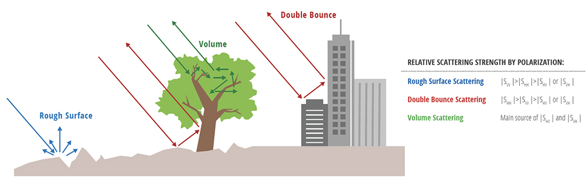

```{r setup, include=FALSE}
options(htmltools.dir.version = FALSE)
```

```{r xaringan-all, echo=FALSE}
library(countdown)
library(xaringan)
library(xaringanExtra)
library(knitr)

hook_source <- knitr::knit_hooks$get('source')
knitr::knit_hooks$set(source = function(x, options) {
  x <- stringr::str_replace(x, "^[[:blank:]]?([^*].+?)[[:blank:]]*#<<[[:blank:]]*$", "*\\1")
  hook_source(x, options)
})

xaringanExtra::use_broadcast()
xaringanExtra::use_freezeframe()
xaringanExtra::use_scribble()
#xaringanExtra::use_slide_tone()
xaringanExtra::use_search(show_icon = TRUE)
xaringanExtra::use_freezeframe()
xaringanExtra::use_clipboard()
xaringanExtra::use_tile_view()
xaringanExtra::use_panelset()
xaringanExtra::use_editable(expires = 1)
xaringanExtra::use_fit_screen()
xaringanExtra::use_extra_styles(
  hover_code_line = TRUE,         
  mute_unhighlighted_code = TRUE  
)

```

class: inverse, center, title-slide, middle

<style>
.title-slide .remark-slide-number {
  display: none;
}
</style>

```{r load_packages, message=FALSE, warning=FALSE, include=FALSE}
library(fontawesome)
```

# Remotely Sensing Cities and Environments

### Lecture 4: Policy applications

### 02/02/2022 (updated: `r format(Sys.time(), "%d/%m/%Y")`)

`r fa("paper-plane", fill = "white")`[a.maclachlan@ucl.ac.uk](mailto:a.maclachlan@ucl.ac.uk)
`r fa("twitter", fill = "white")`[andymaclachlan](https://twitter.com/andymaclachlan)
`r fa("github", fill = "white")`[andrewmaclachlan](https://github.com/andrewmaclachlan)
`r fa("map-marker", fill = "white")`[Centre for Advanced Spatial Analysis, UCL](https://www.ucl.ac.uk/bartlett/casa/)

<a href="https://github.com/andrewmaclachlan" class="github-corner" aria-label="View source on GitHub"><svg width="80" height="80" viewBox="0 0 250 250" style="fill:#fff; color:#151513; position: absolute; top: 0; border: 0; left: 0; transform: scale(-1, 1);" aria-hidden="true"><path d="M0,0 L115,115 L130,115 L142,142 L250,250 L250,0 Z"></path><path d="M128.3,109.0 C113.8,99.7 119.0,89.6 119.0,89.6 C122.0,82.7 120.5,78.6 120.5,78.6 C119.2,72.0 123.4,76.3 123.4,76.3 C127.3,80.9 125.5,87.3 125.5,87.3 C122.9,97.6 130.6,101.9 134.4,103.2" fill="currentColor" style="transform-origin: 130px 106px;" class="octo-arm"></path><path d="M115.0,115.0 C114.9,115.1 118.7,116.5 119.8,115.4 L133.7,101.6 C136.9,99.2 139.9,98.4 142.2,98.6 C133.8,88.0 127.5,74.4 143.8,58.0 C148.5,53.4 154.0,51.2 159.7,51.0 C160.3,49.4 163.2,43.6 171.4,40.1 C171.4,40.1 176.1,42.5 178.8,56.2 C183.1,58.6 187.2,61.8 190.9,65.4 C194.5,69.0 197.7,73.2 200.1,77.6 C213.8,80.2 216.3,84.9 216.3,84.9 C212.7,93.1 206.9,96.0 205.4,96.6 C205.1,102.4 203.0,107.8 198.3,112.5 C181.9,128.9 168.3,122.5 157.7,114.1 C157.9,116.9 156.7,120.9 152.7,124.9 L141.0,136.5 C139.8,137.7 141.6,141.9 141.8,141.8 Z" fill="currentColor" class="octo-body"></path></svg></a><style>.github-corner:hover .octo-arm{animation:octocat-wave 560ms ease-in-out}@keyframes octocat-wave{0%,100%{transform:rotate(0)}20%,60%{transform:rotate(-25deg)}40%,80%{transform:rotate(10deg)}}@media (max-width:500px){.github-corner:hover .octo-arm{animation:none}.github-corner .octo-arm{animation:octocat-wave 560ms ease-in-out}}</style>

---

# How to use the lectures

- Slides are made with [xaringan](https://slides.yihui.org/xaringan/#1)

- `r fa("search")` In the bottom left there is a search tool which will search all content of presentation

- Control + F will also search 

- Press enter to move to the next result 

- `r fa("pencil-alt")` In the top right let's you draw on the slides, although these aren't saved.

- Pressing the letter `o` (for overview) will allow you to see an overview of the whole presentation and go to a slide

- Alternatively just typing the slide number e.g. 10 on the website will take you to that slide

- Pressing alt+F will fit the slide to the screen, this is useful if you have resized the window and have another open - side by side. 

```{r xaringan-logo, echo=FALSE}
xaringanExtra::use_logo(
  image_url = "img/casa_logo.jpg"
)
```
---
# Lecture outline

.pull-left[

### Part 1: Example applcations


### Part 2: Policy challenges

]

.pull-right[
```{r echo=FALSE, out.width='100%'}
knitr::include_graphics('img/satellite.png')
```
.small[Source:[Original from the British Library. Digitally enhanced by rawpixel.](https://www.rawpixel.com/image/571789/solar-generator-vintage-style)
]]

---
class: inverse, center, middle

# Before we can explore policy we really need to look at what remotely sensed data can provide answers to...

---

class: inverse, center, middle

# So...a brief overview...but of course this depends on the data you are using

---

# Data from sensors

Depends on a the combination of spectral bands,  resolutions + cost.

.pull-left[

* Multi-temporal land cover (or land use) mapping 

* Spectral signatures / libraries* 

* Change detection - e.g. urban or forest 

* Vegetation stress - illegal logging 

* Precipitation 

* Elevation models (or point data) - such as LiDAR

* Temperature 

* Night time lights (urban development)
]

.pull-right[

* Forest fire monitoring / predicting / "hot spot" detecting 

* Pollution monitoring 

* Drought indices

* Informal housing detection

* Water level data - monitoring 

* Building or network outline (polygon / line) extraction

* Environmental monitoring (e.g. Aral Sea)

* Estimations of resources - forest, water, snow, ice, green space
]

---
# Different wavelengths show us different things...

.pull-left[
```{r echo=FALSE, out.width='100%'}
knitr::include_graphics('img/spectral_table.PNG')
```
.small[Source:[USGS](https://www.usgs.gov/faqs/what-are-best-landsat-spectral-bands-use-my-research)
]]


.pull-right[
```{r echo=FALSE, out.width='100%'}
knitr::include_graphics('img/spectral_viewer.PNG')
```
.small[Source:[USGS](https://landsat.usgs.gov/spectral-characteristics-viewer)
]]

---
# Urban expansion 

**Sensor**

* Landsat

```{r echo=FALSE, out.width='35%', fig.align='center'}
knitr::include_graphics('img/urban_area.png')
```
.small[Figure 2. Urban expansion within the Perth Metropolitan Region (PMR) between 1990 and 2015. Vast urban growth has been observed in PMR with graduating colours exhibiting outward expansion (a); (b) and (c) exhibit static snapshots of urban extent from 2000 (b) and 2015 (c); whilst (d) depicts percentage of urban change per subnational administrative boundary (Local Government Area; LGA).Source:[MacLachlan et al. 2017](https://www.mdpi.com/2073-445X/6/1/9)
]

---

# Air pollution and LULC

**Sensors**

* Sentinel-3 Sea and Land Surface Temperature
* Sentinel-5 Precursor Major Air Pollutants

LULC transformation on air pollution, increase MAP (Major Air Pollutants) and LST 

* Used regression...

* Honeycombing - hex grids for different sensor data

```{r echo=FALSE, out.width='60%', fig.align='center'}

```
.small[Fig. 2. The classified honeycomb dataset for LST, PM₂.₅, SO₂, NO₂, CO, and O₃..Source:[Fuldalu and Alta, 2021](https://www.sciencedirect.com/science/article/pii/S2212095521001887?casa_token=0kyJ1dZmkm0AAAAA:syu0WnpPpsCKiY6PiBfzkf2epGa5uldthCpOt1Hey9_pmOF_uel1WpuYECTvF0jr3uzcRCrbd5k#f0005)
]

---

class: inverse, center, middle

# Land Use and (?) Land Cover (LULC) 

---

# Urban green spaces

**Sensors / data**
.pull-left[
* Landsat (medium res 17%)
* Sentinel]

.pull-right[
* LiDAR $
* High spatial resolution (38%) $
* High + medium res = 9%
]

Studies

  * Accessibility to urban green spaces - usual kind of stuff
  
  * Also, now types of vegetation - DEM, elevation models and relationship to well being and health 
  
  * Google street view! - sky view factor and iTree
  
  * Google Earth Engine - Compare health benefits in relation to green space over 25 cities

* Vegetation health - targeted intervention 

* Landscape indexes - mean patch size, patch density and edge density 

.small[Remote sensing of urban green spaces: A review. Source:[Shahtahmassebi et al. 2021](https://www.sciencedirect.com/science/article/pii/S1618866720307639?casa_token=ZrACATZktIAAAAAA:9bCBg0pBWBsIPmYMufywYK54cyPXoImsgNxQCN_JBR2zUQ50mvnKHcKZ9CnB2ywCNNsOCw-tpBU#!)
]
---

# Disaster response / preparedness  

**Sensor**

Sentinel-2 spectral imagery 

  * Image difference (post event - pre-event)
  * View-shed analysis (building outlines / DEM)
  
```{r echo=FALSE, out.width='80%', fig.align='center'}

```

.small[Building a 3D Model of the Beirut Explosion. Source:[Ollie Ballinger](https://oballinger.github.io/beirut-3D-model/)
]

---

# Disaster response / preparedness 2

```{r echo=FALSE, out.width='50%', fig.align='center'}
knitr::include_graphics('img/GIF_1.gif')
```

.small[Building a 3D Model of the Beirut Explosion. Source:[Ollie Ballinger](https://oballinger.github.io/beirut-3D-model/)
]
---

class: inverse, center, middle

# Synthetic Aperture Radar (SAR)

---

# SAR floods

**Sensor**

* Sentinel-1 SAR 

ENSO phases but this is from Australian La Niña 2022
  * trade winds from south america intensity
  * draw up cool deep waters and increase thermocline 
  * temp difference increases, walker circulation intensifies - feedback loop
  * more cloud + more rain + cyclones in West Pacific 

```{r echo=FALSE, out.width='35%', fig.align='center'}

```

.small[Eastern Australia Floods. Source:[brockmann-consult](https://www.brockmann-consult.de/eastern-australia-floods/)
]

---

# SAR background

Synthetic Aperture Radar:
  * Active sensors
  * Have surface texture data
  * See through weather and clouds 
  * Different wavelengths - different applications
  
```{r echo=FALSE, out.width='50%', fig.align='center'}
knitr::include_graphics('img/SAR_bands.PNG')
```

.small[What is Synthetic Aperture Radar?. Source:[NASA Earth Data](https://earthdata.nasa.gov/learn/backgrounders/what-is-sar)
]
  
---

# SAR background 2

  * Also different ploarizations - orientation of the plane in which EMR waves transmitted..
  
  > Polarization refers to the orientation of the plane in which the transmitted electromagnetic wave oscillates. While the orientation can occur at any angle, SAR sensors typically transmit linearly polarized. The horizontal polarization is indicated by the letter H, and the vertical polarization is indicated by V.
  
```{r echo=FALSE, out.width='75%', fig.align='center'}

```

.small[What is Synthetic Aperture Radar?. Source:[NASA Earth Data](https://earthdata.nasa.gov/learn/backgrounders/what-is-sar)
]

---

# SAR image

```{r echo=FALSE, out.width='75%', fig.align='center'}
knitr::include_graphics('img/SAR.png')
```

Paper also goes through some correction methods that should be familiar! 

.small[Urban objects detection from C-band synthetic aperture radar (SAR) satellite images through simulating filter properties. Source:[Deepak Kumar, 2021](https://www.nature.com/articles/s41598-021-85121-9)
]

---
# SAR image 2

"multitemporal colour composite SAR image, rice growing areas in the Mekong River delta, Vietnam 1996." 


.pull-left[
"Three SAR images acquired by the ERS satellite during 5 May, 9 June and 14 July in 1996 are assigned to the red, green and blue channels respectively for display. The colourful areas are the rice growing areas, where the landcovers change rapidly during the rice season. The greyish linear features are the more permanent trees lining the canals. The grey patch near the bottom of the image is wetland forest. The two towns appear as bright white spots in this image. An area of depression flooded with water during this season is visible as a dark region."

]

.pull-right[

```{r echo=FALSE, out.width='100%', fig.align='center'}
knitr::include_graphics('img/multitemporal colour composite SAR image.png')
```
]

.small[SAR Images. Source:[CRISP](https://crisp.nus.edu.sg/~research/tutorial/sar_int.htm)
]

---

# SAR background 3

Scattering can change based on wavelength 

Further penetration then the volume scattering will change

```{r echo=FALSE, out.width='100%', fig.align='center'}
knitr::include_graphics('img/SARtree_figure2.jpg')
```

.small[What is Synthetic Aperture Radar?. Source:[NASA Earth Data](https://earthdata.nasa.gov/learn/backgrounders/what-is-sar)
]


---
# SAR background 4

Some terms:   

> Backscatter is the portion of the outgoing radar signal that the target redirects directly back towards the radar antenna

The higher the backscattered intensity = rougher the surface. It is "unitless"

Can be converted to "backscatter coefficient, or sigma nought", measured in decibel (dB) units = normalised measure of the radar return from a distributed target 

If the signal is from backscatter is not desired = "clutter"

* Has been used in urban monitoring BUT...

  * Corner reflections in urban environments 
  * Shadowing - building behind another not imaged 
  * Speckle - grainy, from scattering on ground - "salt and pepper"
  
.small[Source:[NASA Earth Data](https://sentinels.copernicus.eu/web/sentinel/user-guides/sentinel-1-sar/definitions#:~:text=Backscatter%20is%20the%20portion%20of,by%20which%20backscatter%20is%20formed.)
]

.small[Source:[Urban Area Delineation Using InSAR Products](https://webapps.itc.utwente.nl/librarywww/papers/msc_2002/gfm/luhega.pdf)
]

---

# Me on SAR

> Although SAR images over urban areas provide low quality images due to problems associated with radar imaging in such an environment (i.e. multiple bouncing, layover and shadowing), SAR texture measures can provide valuable information in discerning urban areas (Dell’Acqua et al., 2003; Zhu et al., 2012). Isolated scattering of residential areas and crowded backscatters of inner city high density areas permit classification refinement, thus textural measures such as those descried within the spatial domain can aid identification of alternative urban forms (Zhu et al., 2012). 

>However, the lack of freely available SAR data that temporally coincides with other satellite imagery (e.g. Landsat) frequently precludes extensive use


---

class: inverse, center, middle

# To use SAR or not to use SAR...that is the question...

---

# InSAR

Interferometry Synthetic Aperture Radar (InSAR)
 * Take two RADAR observations of the target (e.g. the ground)
 * The two 
 * Use the phase difference 
 * Phase = 
  > "total number of cycles of the wave at any given distance from the transmitter, including the fractional part"

* Phase difference - SUBTRACT the values (measured phase values) at two different measurement points

* Differential distance depends on the height of the terrain (topography)

* Used for creating DEMs

* Monitoring displacement of ground - earthquakes etc

.small[INTERFEROMETRY EXPLAINED - MORE DETAIL. Source:[NASA SRTM](https://www2.jpl.nasa.gov/srtm/instrumentinterfmore.html)
]
  

---
# InSAR 2

Key terms

* Coherence Map

  >  Coherence is defined as the degree of similarity of backscattering response (or reflection characteristic of as measured by the SAR sensor) between corresponding ground cells in both SAR image of an InSAR pair. 

* Differential Interferometry Synthetic Aperture Radar (DInSAR)
  
> "quantification of the ground displacement that occurred between the two acquisitions can be achieved" through a "differential interferogram"

.small[Source:[Michel Gay](http://www.permanet-alpinespace.eu/archive/pdf/WP6_1_dinsar.pdf)
]

---
# InSAR 3


```{r echo=FALSE, out.width='100%', fig.align='center'}

```

.small[INTERFEROMETRY EXPLAINED - MORE DETAIL. Source:[NASA SRTM](https://www2.jpl.nasa.gov/srtm/instrumentinterfmore.html)
]

---
# SAR applications

SAR applications, an emerging trend: https://www.mdpi.com/journal/remotesensing/special_issues/Urban_SAR 

* Damage detection: https://www.sciencedirect.com/science/article/pii/S0924271621000010?casa_token=Peuv4YfQjsEAAAAA:wAdc-R2tEjK7L4maY6ZcOio3YyIZPnb7HgqXi5SQZAeIoYq8bApu9iA6H-281attgj1dwQ-IPz8 

* Urban area mapping: https://www.sciencedirect.com/science/article/pii/S0034425721002352?casa_token=6kKdHHJ_GZ4AAAAA:LDl85LIgl6O8G_NNSgxfBgcGw7vpRrS0JAd5STW5obGnGDuO2l0RmkdzzLqLEbqNbO0MSzdhFPU

* Urban flooding (lower backscatter coefficient): https://www.mdpi.com/2071-1050/12/14/5784 

* Landslides

* Earthquakes

* Data fusion* / DEM creation

---

# Monitoring forests + illegal logging 

**Sensor**

* Landsat (2000 to 2012)

Monitoring forest loss and illegal logging 

* Pre-processing

> "Landsat pre-processing steps included: (i) image resampling, (ii) conversion of raw
digital values (DN) to top of atmosphere (TOA) reflectance, (iii) cloud/shadow/water
screening and quality assessment (QA), and (iv) image normalization"

> The stack of QA layers was used to create a perpixel set of cloud-free image observations which in turn was employed to calculate timeseries spectral metrics.

---

# Monitoring forests + illegal logging 2

* Creating metrics

> Metrics represent a generic feature space that facilitates regionalscale mapping and have been used extensively with MODIS and AVHRR data

> (i) reflectance values representing maximum, minimum and selected percentile values 
  (ii) mean reflectance values for observations between selected percentiles
  (iii) slope of linear regression of band reflectance value versus
image date.

In support of this reference is given to [Hansen et al. 2010](https://www.pnas.org/doi/epdf/10.1073/pnas.0912668107)...supplementary material...

> The time-sequential MODIS 32-dayinputs were transformed to annual metrics to produce a more generalized feature space

---
# Monitoring forests + illegal logging 3

> "a more generalized feature space"

* Feature space = scattergram of two bands (or things that have been made into bands)

* Can be used for very basic classification - selecting the values that represent land cover

.pull-left[
```{r echo=FALSE, out.width='100%', fig.align='center'}
knitr::include_graphics('img/Multi_Hyper-spectral_Image_feature_space.svg')
```
.small[Feature space. Source:[Wikimedia commons 2022](https://commons.wikimedia.org/wiki/File:Multi_Hyper-spectral_Image_feature_space.svg)
]
]

.pull-right[
```{r echo=FALSE, out.width='80%', fig.align='center'}
knitr::include_graphics('img/Spectral-curves-scatter-plot.png')
```
.small[Spectral curves on the scatter plot. Source:[50northspatial](http://www.50northspatial.org/n-dimensional-spectral-feature-space-envi/)
]
]
---
# Monitoring forests + illegal logging 4

* Training data

> Training data to relate to the Landsat metrics were derived from image interpretation methods, including mapping of crown/no crown categories using very high spatial resolution data such as Quickbird imagery, existing percent tree cover layers derived from Landsat data (29), and global MODIS percent tree cover (30), rescaled using the higher spatial resolution percent tree cover data sets

```{r echo=FALSE, out.width='80%', fig.align='center'}
knitr::include_graphics('img/training_data.png')
```
.small[REMAP method. Source:[UN-SPIDER](https://www.un-spider.org/news-and-events/news/new-online-remote-sensing-application-land-cover-classification-and-monitoring)
]

---

# Monitoring forests + illegal logging 5

* Classification (supervised or unsupervised)

> Decision trees are hierarchical classifiers that predict class membership by recursively partitioning a data set into more homogeneous or less varying subsets, referred to as nodes

```{r echo=FALSE, out.width='50%', fig.align='center'}
knitr::include_graphics('img/Hansen_forest_change.jpeg')
```

.small[FIG. 2 Regional subsets of 2000 tree cover and 2000 to 2012 forest loss and gain.(A) Paraguay, centered at 21.9°S, 59.8°W; (B) Indonesia, centered at 0.4°S, 101.5°E; (C) the United States, centered at 33.8°N, 93.3°W; and (D) Russia, centered at 62.1°N, 123.4°E. Source:[Hansen et al. 2013](https://www.science.org/doi/10.1126/science.1244693)
]

Used in Brazil to [target illegal logging]( https://news.mongabay.com/2019/04/how-a-sheriff-in-brazil-is-using-satellites-to-stop-deforestation/) 

---

# Example 7 

Forest fires 

Water scarcity 

---

class: inverse, center, middle

# The key is usually **combining the remote sensing data** with GIS or other datasets to answer questions

--

# The data is consistent over days, months and years

---

class: inverse, center, middle

# We will look at applicaitons in the next few weeks, but first we will explore policy to understand where remote sensing data can be applied.

---

class: center, middle

# We will look at applicaitons in the next few weeks, but first we will explore policy to understand where remote sensing data can **possibly** be applied.


---

https://link.springer.com/article/10.1007/s41207-016-0007-4

https://www.sciencedirect.com/journal/international-journal-of-applied-earth-observation-and-geoinformation/vol/108/suppl/C 
